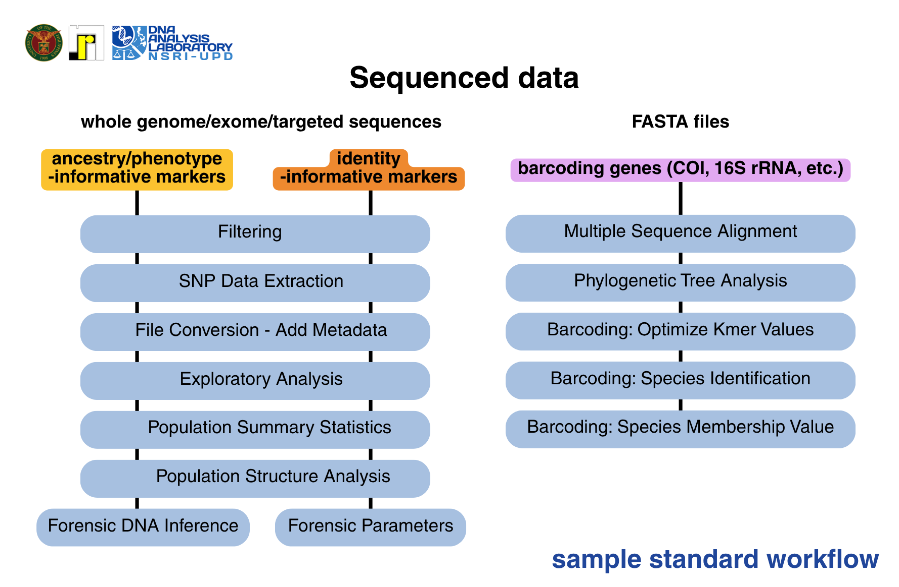

<p align = "center">

</p>  

# restful-forensics  
```restful forensics``` is an open-source platform for forensic genetics research
workflow and method validation. This tool is built as a Shiny app in R and
incorporates commonly used packages, functions, and software for genetic data preparation,
pre-processing, and exploratory data analysis. 
See the [documentation](https://upd-dal.github.io/restfulForensics/) for more information.


restful forensics is developed at the Natural Sciences Research Institute,
University of the Philippines Diliman, Quezon City.

## Table of Contents
1. [About](#About)  
2. [Features](#Features)  
3. [Installation](#Installation) <br>
   a. [Prerequisites](#A-Prerequisites) <br>
   b. [Dependency List](#B-Dependencies) <br>
   c. [Installation Guide](#C-Installation-Guide) <br>
4. [Example Workflow](#Example-Workflow)  
5. [Software Architecture](#Software-Architecture) 
6. [Limitations](#Limitations) <br>
   a. [Known Limitations](#Known-Limitations) <br>
   b. [Planned Enhancements](#Planned-Enhancements) <br>
7. [Citation Guide](#Citation-Guide)  
8. [License](#License)  

## About
The restful (Reproducible and Efficient Sequence Toolkit) forensics app is a free R-based tool developed to assist forensic genetics
researchers in navigating genomic data analysis for forensic applications. It consolidates
genetic data preprocessing and method validation into one interactive platform using
widely used R packages and the incorporation of external software/executables into R
for a unified workflow.


## Features
restful forensics has 9 distinct modules with submodules for more specific tasks.
The following tables describe the functionalities and general requirements
for sub/modules:

*Module 1: File Conversion*  
| # | Feature | Description | Input file/s | Output | Related Tools |
| :---: | :--- | :--- | :---: | :---: | :---: |
| 1 | Convert Files | Interconvert single or zipped VCF, BCF, CSV, or PLINK-associated files | VCF, BCF, PLINK files | VCF or PLINK files | PLINK 2.0 |
| 2 | Add Metadata | Merge genotype data with metadata based on shared keywords (sample IDs) | VCF, BCF, PLINK, CSV file/s | CSV files | |
| 3 | Widen SNP calls | Convert long-formatted SNP calls to a wide format | Compressed file (.zip/.tar) containing .csv or .xlsx files | CSV file | |
| 4 | To SNIPPER file | Convert .csv or .xlsx files into a SNIPPER-compatible file for individual classification using ancestry-informative markers | CSV/XLSX file | Excel (.xlsx) file | |
| 5 | To STRUCTURE file | Converts .csv or .xlsx files to a STRUCTURE v2.3.4-compatible file | CSV/XLSX file | Structure (.str) file | |
| 6 | To Arlequin file | Converts .csv or .xlsx files to an Arlequin-compatible file | CSV/XLSX file | Arlequin (.arp) file | |

*Module 2: SNP Data Extraction*
| # | Feature | Description | Input file/s | Output | Related Tools |
| :---: | :--- | :--- | :---: | :---: | :---: |
| 1 | SNP Data Extraction | Extract specific SNP calls from genome-wide data (VCF or PLINK associated files) based on rsID or position | VCF, BCF, PLINK files | VCF file | PLINK 2.0 |
| 2 | Concordance Analysis | Check concordance of calls between datasets with overlapping samples | Two .csv and/or .xlsx files | Excel (.xlsx) and PNG file | |

*Module 3: Filtering*
| # | Feature | Description | Input file/s | Output | Related Tools |
| :---: | :--- | :--- | :---: | :---: | :---: |
| 1 | Filtering | Perform quality control/filtering of samples and variants using standard options in PLINK 2.0 | VCF, BCF, PLINK files | VCF file | PLINK 2.0 |

*Module 4: Exploratory Analysis*
| # | Feature | Description | Input file/s | Output | Related Tools |
| :---: | :--- | :--- | :---: | :---: | :---: |
| 1 | Exploratory Analysis | Perform Principal Components Analysis using multivariate SNP data | CSV/XLSX file | PNG plots | Ade4 |

*Module 5: Population Summary Statistics*
| # | Feature | Description | Input file/s | Output | Related Tools |
| :---: | :--- | :--- | :---: | :---: | :---: |
| 1 | R-based Calculations | Calculate common population statistics using R-based packages | CSV/XLSX file | Excel (.xlsx) and PNG files | _poppr_, _hierfstat_, and _adegenet_ |
| 2 | Arlecore | Calculate common population statistics using Arlecore, the terminal-based version of Arlequin | Excel (.xlsx) and PNG files | Arlecore |

*Module 6: Population Structure Analysis*
| # | Feature | Description | Input file/s | Output | Related Tools |
| :---: | :--- | :--- | :---: | :---: | :---: |
| 1 | Run STRUCTURE v2.3.4 | Perform population structure analysis | CSV/XLSX file | Structure (.str) file, STRUCTURE results, Q matrices, and .ind files | STRUCTURE v2.3.4 and _strataG_ |
| 2 | Plot STRUCTURE results | Visualize STRUCTURE results | CSV/XLSX file | Structure plot (.png and .pdf) | CLUMPP and _strataG_ |

*Module 7: Forensic Parameters*
| # | Feature | Description | Input file/s | Output | Related Tools |
| :---: | :--- | :--- | :---: | :---: | :---: |
| 1 | Forensic Parameters | Calculate forensic parameters specific for individual identity SNPs | CSV/XLSX file | Excel (.xlsx) file | |

*Module 8: Forensic DNA Inference*
| # | Feature | Description | Input file/s | Output | Related Tools |
| :---: | :--- | :--- | :---: | :---: | :---: |
| 1 | Forensic DNA Inference | Perform NaÏve Bayes classification to evaluate classification performance of markers | CSV/XLSX file | Excel (.xlsx) file | _caret_ and _e1071_ |

*Module 9: DNA Barcoding*
| # | Feature | Description | Input file/s | Output | Related Tools |
| :---: | :--- | :--- | :---: | :---: | :---: |
| 1 | Multiple Sequence Alignment | Perform global alignment using select methods | Zipped FASTA files | PDF and FASTA file of alignment | _msa_ |
| 2 | Phylogenetic Tree Analysis | Build a phylogenetic tree based on aligned sequences | Alignment file | PNG file | _DECIPER_ |
| 3 | Barcoding | Perform species identification, evaluate barcodes, calculate barcoding gap, and calculate species membership value | Aligned sequences | Metrics | _BarcodingR_ |


## Installation

### A. Prerequisites
- [R (R version 4.6.1 and above)](https://cran.r-project.org/bin/windows/base/)
- [Rtools (compatible with R >= 4.6.1)](https://cran.r-project.org/bin/windows/Rtools/)
- (optional) Any Integrated Development Environment. Suggestion is to use [RStudio.](https://docs.posit.co/ide/user/#rstudio-ide-oss-downloads)

### B. Dependencies
The list of package dependencies are listed under "R/packages.R" and are installed upon running ```source("install.R")```

### C. Installation Guide
1 Clone the repository  
```git clone https://github.com/NSRI-DAL-2025-Project/restfulForensics.git --branch alpha-test```  

2 Run the application  
```
source("install.R")
shiny::runApp()
```  
  
## Example Workflow
The modules within restful forensics can be run independently or as part of a workflow. For certain marker panels,
a sample workflow can be visualized in Fig 1.


The restful forensics has been tested using data from the 1000 Genomes Project.
Figure 2 shows a more detailed pipeline:


## Software Architecture
As a shiny application, restful forensics is divided into the user interface (UI)
and server functions. The app is modularized by having a separate UI and server
R files for each feature. The ui section is responsible for input requests 
which are then read and processed into the associated server files and exposed 
by the ui. The pipeline is presented in Figures 1 and 2.

## Limitations

### Known Limitations
| # | Module | Submodule | Limitation |
| :---: | :--- | :--- | :---: |
| 1 | File Conversion | To STRUCTURE File | No option to add extra information/columns, standard parameters are set based on strataG |
| 2 | File Conversion | To Arlequin File | <ul><li>Datatype is automatically set to "Standard"</li><li>No option to specify genetic/group structure</li></ul> |
| 3 | Population Summary Statistics | Arlecore | <ul><li>Parameters for running arlecore are set with performing LD test the only provided additional option</li><li>Statistics calculated: Diversity and HWE metrics, Expected Heterozygosities, FST, Coancestry Coefficient, and Loci in LD</li></ul> |
| 4 | Population Structure Analysis | Run STRUCTURE v2.3.4 | Same limited parameters as set in the strataG R package |
| 5 | Forensic Parameters | Forensic Parameters | Calculation of Random Match Probability given a profile is untested |
| 6 | DNA Barcoding | Multiple Sequence Alignment | Only global alignment can be performed |

### Planned Enhancements
1. *File Conversion: To STRUCTURE File*
Additional options to set main and extra parameters.

2. *DNA Barcoding*
Add option to perform local sequence alignment.

3. _*Additional Feature: Incorporation of ADMIXTURE software*_

## Citation Guide

## License
restful forensics operates under the GNU General Public License
