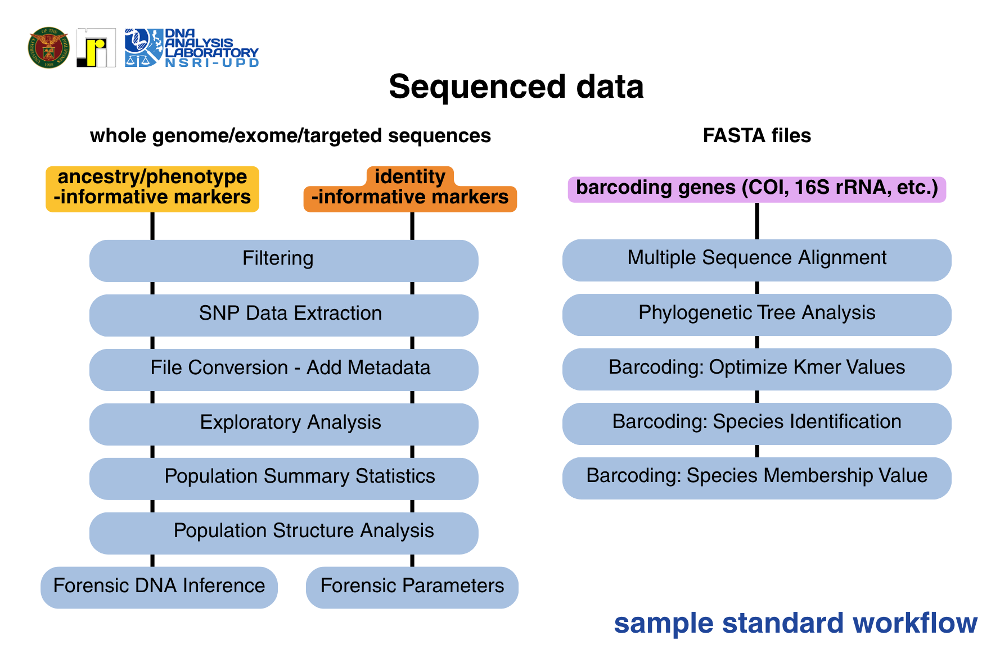
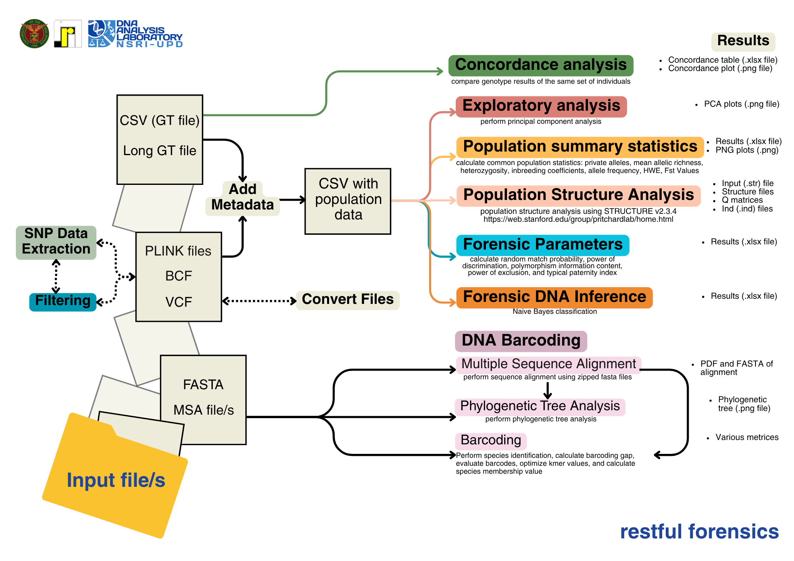

<p align = "center">

</p>  

# restful forensics  
```restful forensics``` is an open-source platform for forensic genetics research
workflow and method validation. This tool is built as a Shiny app in R and
incorporates commonly used packages, functions, and software for genetic data preparation,
pre-processing, and exploratory data analysis. 
See the [documentation](https://upd-dal.github.io/restfulForensics/) for more information.


restful forensics is developed at the Natural Sciences Research Institute,
University of the Philippines Diliman, Quezon City.

## Table of Contents
1. [About](#About)  
2. [Features](#Features)  
3. [Installation](#Installation) <br>
   a. [Prerequisites](#A-Prerequisites) <br>
   b. [Installation Guide](#C-Installation-Guide) <br>
4. [Example Workflow](#Example-Workflow)  
5. [Software Architecture](#Software-Architecture) 
6. [Limitations](#Limitations) <br>
   a. [Known Limitations](#Known-Limitations) <br>
   b. [Planned Enhancements](#Planned-Enhancements) <br>
7. [Citation Guide](#Citation-Guide)  
8. [License](#License)  

## About
The restful (Reproducible and Efficient Sequence Toolkit) forensics app is a free R-based tool developed to assist forensic genetics
researchers in navigating genomic data analysis for forensic applications. It consolidates
genetic data preprocessing and method validation into one interactive platform using
widely used R packages and the incorporation of external software/executables into R
for a unified workflow.


## Features
restful forensics has 9 distinct modules with submodules for more specific tasks.
The following tables describe the functionalities and general requirements
for sub/modules:

*Module 1: File Conversion*  
| # | Feature | Description | Input file/s | Output | Related Tools |
| :---: | :--- | :--- | :---: | :---: | :---: |
| 1 | Convert Files | Interconvert single or zipped VCF, BCF, CSV, or PLINK-associated files | VCF, BCF, PLINK files | VCF or PLINK files | PLINK 2.0 |
| 2 | Add Metadata | Merge genotype data with metadata based on shared keywords (sample IDs) | VCF, BCF, PLINK, CSV file/s | CSV files | |
| 3 | Widen SNP calls | Convert long-formatted SNP calls to a wide format | Compressed file (.zip/.tar) containing CSV/Excel files | CSV file | |
| 4 | To SNIPPER file | Convert CSV/Excel files into a SNIPPER-compatible file for individual classification using ancestry-informative markers | CSV/Excel file | Excel (.xlsx) file | |
| 5 | To STRUCTURE file | Converts CSV/Excel file to a STRUCTURE v2.3.4-compatible file | CSV/Excel file | Structure (.str) file | |
| 6 | To Arlequin file | Converts CSV/Excel file to an Arlequin-compatible file | CSV/Excel file | Arlequin (.arp) file | |

*Module 2: SNP Data Extraction*
| # | Feature | Description | Input file/s | Output | Related Tools |
| :---: | :--- | :--- | :---: | :---: | :---: |
| 1 | SNP Data Extraction | Extract specific SNP calls from genome-wide data (VCF or PLINK associated files) based on rsID or position | VCF, BCF, PLINK files | VCF file | PLINK 2.0 |
| 2 | Concordance Analysis | Check concordance of calls between datasets with overlapping samples | CSV/Excel/VCF files | Excel (.xlsx) and PNG file | |

*Module 3: Filtering*
| # | Feature | Description | Input file/s | Output | Related Tools |
| :---: | :--- | :--- | :---: | :---: | :---: |
| 1 | Filtering | Perform quality control/filtering of samples and variants using standard options in PLINK 2.0 | VCF, BCF, PLINK files | VCF file | PLINK 2.0 |

*Module 4: Exploratory Analysis*
| # | Feature | Description | Input file/s | Output | Related Tools |
| :---: | :--- | :--- | :---: | :---: | :---: |
| 1 | Exploratory Analysis | Perform Principal Components Analysis using multivariate SNP data | CSV/Excel file | PNG plots | [_ade4 v1.7.24_](https://CRAN.R-project.org/package=ade4) |

*Module 5: Population Summary Statistics*
| # | Feature | Description | Input file/s | Output | Related Tools |
| :---: | :--- | :--- | :---: | :---: | :---: |
| 1 | R-based Calculations | Calculate common population statistics using R-based packages | CSV/Excel file | Excel (.xlsx) and PNG files | [_poppr v2.9.8_](https://CRAN.R-project.org/package=poppr), [_hierfstat v0.5.11_](https://CRAN.R-project.org/package=hierfstat), and [_adegenet v2.1.11_](https://CRAN.R-project.org/package=adegenet) |
| 2 | Arlecore | Calculate common population statistics using Arlecore, the terminal-based version of Arlequin | CSV/Excel | Excel (.xlsx) and PNG files | Arlecore |

*Module 6: Population Structure Analysis*
| # | Feature | Description | Input file/s | Output | Related Tools |
| :---: | :--- | :--- | :---: | :---: | :---: |
| 1 | Run STRUCTURE v2.3.4 | Perform population structure analysis | CSV/Excel file | Structure (.str) file, STRUCTURE results, Q matrices, and .ind files | STRUCTURE v2.3.4 and _strataG_ |
| 2 | Plot STRUCTURE results | Visualize STRUCTURE results | CSV/Excel file | Structure plot (.png and .pdf) | CLUMPP and [_strataG_](https://github.com/EricArcher/strataG) |

*Module 7: Forensic Parameters*
| # | Feature | Description | Input file/s | Output | Related Tools |
| :---: | :--- | :--- | :---: | :---: | :---: |
| 1 | Forensic Parameters | Calculate forensic parameters specific for individual identity SNPs | CSV/Excel file | Excel (.xlsx) file | |

*Module 8: Forensic DNA Inference*
| # | Feature | Description | Input file/s | Output | Related Tools |
| :---: | :--- | :--- | :---: | :---: | :---: |
| 1 | Forensic DNA Inference | Perform NaÏve Bayes classification to evaluate classification performance of markers | CSV/Excel file | Excel (.xlsx) file | [_caret_ v7.0.1](https://cran.r-project.org/web/packages/caret/index.html) and [_e1071 v1.7.17_](https://cran.r-project.org/web/packages/e1071/index.html) |

*Module 9: DNA Barcoding*
| # | Feature | Description | Input file/s | Output | Related Tools |
| :---: | :--- | :--- | :---: | :---: | :---: |
| 1 | Multiple Sequence Alignment | Perform global alignment using select methods | Zipped FASTA files | PDF and FASTA file of alignment | [_msa_ v1.44.1](https://www.bioconductor.org/packages/release/bioc/html/msa.html) and [_DECIPER v3.8.1_](https://bioconductor.org/packages/release/bioc/html/DECIPHER.html) |
| 2 | Phylogenetic Tree Analysis | Build a phylogenetic tree based on aligned sequences | Alignment file | PNG file | [_ggtree v4.2.0_](https://bioconductor.org/packages/ggtree/) and [_phangorn v2.12.1_](https://CRAN.R-project.org/package=phangorn) |
| 3 | Barcoding | Perform species identification, evaluate barcodes, calculate barcoding gap, and calculate species membership value | Aligned sequences | Metrics | [_BarcodingR v1.0.4_](https://cran.r-project.org/web/packages/BarcodingR/index.html) |


## Installation
This is a Windows-based shiny application. 

### A. Prerequisites
- [R (R version 4.6.1 and above)](https://cran.r-project.org/bin/windows/base/)
- [Rtools (compatible with R >= 4.6.1)](https://cran.r-project.org/bin/windows/Rtools/)
- (optional) Any Integrated Development Environment. Suggestion is to use [RStudio.](https://docs.posit.co/ide/user/#rstudio-ide-oss-downloads)
- [Git](https://git-scm.com/)  
**For complete functionalities, to be placed in the root folder:**
- Windows (without front end) implementation of [STRUCTURE v2.3.4](https://web.stanford.edu/group/pritchardlab/structure_software/release_versions/v2.3.4/html/structure.html)
- Terminal implementation of Arlequin v3.5.2.2, [Arlecore v3.5.2](https://cmpg.unibe.ch/software/arlequin35/Arl35Downloads.html)
- Windows implementation of [CLUMPP](https://rosenberglab.stanford.edu/clumppDownload.html)

### B. Installation Guide  

1. Clone the repository  
  
*Using Windows PowerShell*  
- Ensure that Git is installed in your system. If not, download from the official (website)(https://git-scm.com/) and install.  
- Within PowerShell, configure username and email:  
```
git config --global user.name "Your Name" 
git config --global user.email "you@example.com"
```  
- Verify installation by doing ```git --version```  
- Launch PowerShell with appropriate permissions (admin privileges if required)  
- Clone the repository by performing: ```git clone https://github.com/upd-dal/restfulForensics```  

*Using RStudio IDE*  
- Open RStudio  
- Go to File > New Project > Version Control > Git  
- Paste the URL into 'Repository URL': https://github.com/upd-dal/restfulForensics  
- Set directory then click *Create Project*. RStudio clones and opens the project.  

*Using R Terminal*  
- Ensure that Git is installed in your system. Check by performing ```git --version```  
- Open the R terminal (beside the Console) and run: ```git clone https://github.com/upd-dal/restfulForensics```  

2. Launch the application  
- Change directory in R to where the repository was copied  
- Launch the application by copying and pasting the following commands to the console:  
```
source("install.R")
shiny::runApp()
```  
  
## Example Workflow
The modules within restful forensics can be run independently or as part of a workflow. For certain marker panels,
a sample workflow can be visualized as follows:

Figure 1. Sample workflow for different forensic marker panels.

The restful forensics has been tested using SNP data
based on the [Kidd et al. (2014)](https://www.sciencedirect.com/science/article/pii/S1872497314000039?via%3Dihub)
panel on biogeographical ancestry markers from the 1000 Genomes Project and Human Genome Diversity Projects' VCF files. 
The barcoding section has been tested on 16S rRNA sequences from _Lactobacillus_ spp
sourced from NCBI. 
<br>
Figure 2 shows a more detailed pipeline:

Figure 2. Pipelines within restful forensics.

## Software Architecture
As a shiny application, restful forensics is divided into the user interface (UI)
and server functions. The app is modularized by having a separate UI and server
R files for each feature. The ui section is responsible for input requests 
which are then read and processed into the associated server files and exposed 
by the ui. The pipeline is presented in Figures 1 and 2.

## Limitations

### Known Limitations
| # | Module | Submodule | Limitation |
| :---: | :--- | :--- | :---: |
| 1 | File Conversion | To STRUCTURE File | No option to add extra information/columns, standard parameters are set based on strataG. However, output can be manually edited using any text editor. |
| 2 | File Conversion | To Arlequin File | <ul><li>Datatype is automatically set to "Standard"</li><li>No option to specify genetic/group structure</li></ul> However, output can be manually edited using any text editor. |
| 3 | Population Summary Statistics | Arlecore | <ul><li>Statistics calculated: Expected Heterozygosities, FST, and Coancestry Coefficient. There is also an option to calculate loci in LD and the Diversity and HWE metrics</li><li>Crowded labels on plots with >10 populations</li></ul> |
| 4 | Population Structure Analysis | Run STRUCTURE v2.3.4 | Same limited parameters as set in the strataG R package |
| 5 | Forensic Parameters | Forensic Parameters | Calculation of Random Match Probability given a profile is untested |
| 6 | DNA Barcoding | Multiple Sequence Alignment | Only multiple sequence alignments can be performed |

### Planned Enhancements
1. *File Conversion: To STRUCTURE File*
Additional options to set main and extra parameters.

2. *Population Summary Statistics: Arlecore*
Plot adjustments to accommodate >10 populations.

3. *DNA Barcoding*
Add option to perform pairwise alignments and export alignment as BAM/SAM.

4. _*Additional Feature: Incorporation of ADMIXTURE software*_  

## Citation Guide  
To cite the application: Samin LC [aut], Soliven NFJ [aut], Matias MA [ctb], & Salvador J [ctb]. (2025). restfulForensics (Version 1.0) [Computer software]. GitHub. https://github.com/upd-dal/restfulForensics

Manuscript in preparation.  

## License  
restful forensics operates under the GNU General Public License v3.0  

